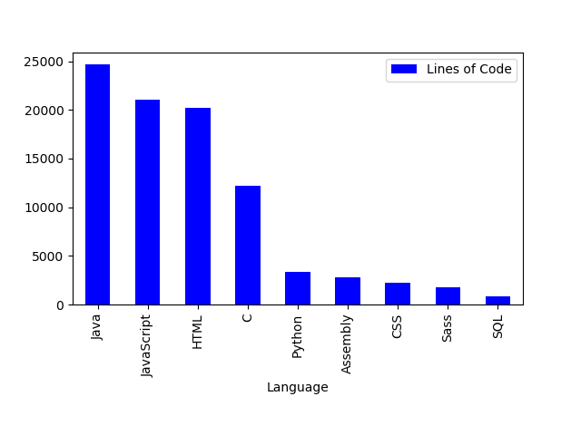

# cloc-uni

During my studies at ZHAW I was introduced to to many different languages. But we did not have equal opportunities to improve them.

I was interested to see **how much** I had programmed with a given language. So I wrote a python script that cloned all my repositories from the school [GitHub Enterprise](!https://github.engineering.zhaw.ch/) and then counted the lines of code.
I then took that data and ploted it.

Output: 07.03.2019

